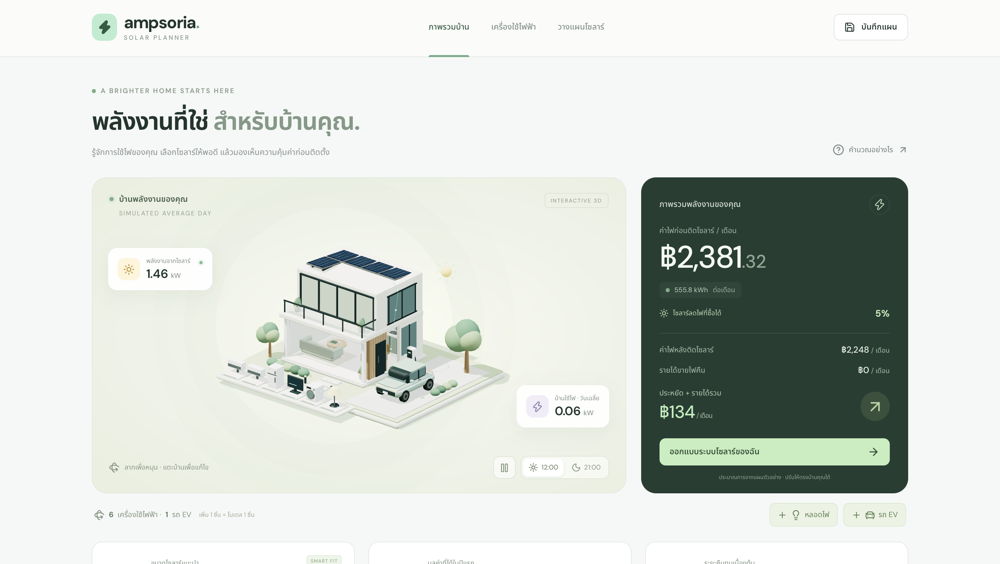
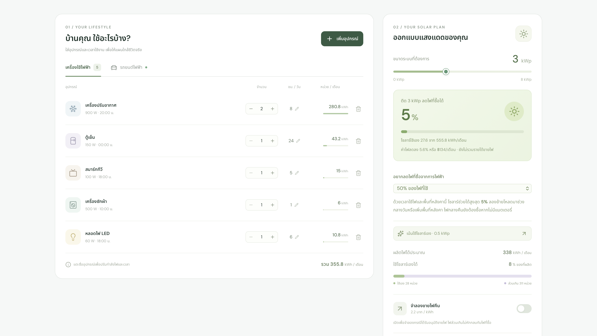
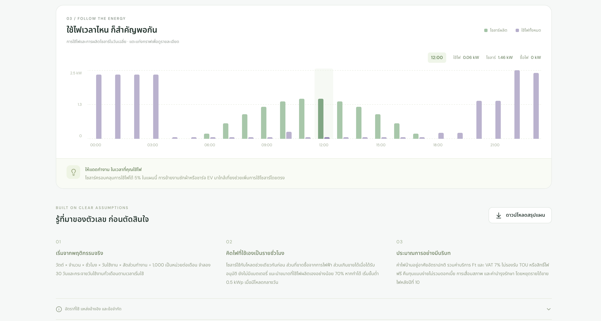

<div align="center">
  <h1>☀️ Ampsoria Solar Planner ☀️</h1>
  <p><i>A Thai-language home solar planner with an interactive 3D house, appliances, and EV charging simulation.</i></p>

  [](https://ampsoria-solar-planner.ampsoriainyourarea.workers.dev)
</div>

---

## ✨ Features

- 🏠 **Interactive 3D House**: Powered by Three.js! Rotate, zoom, switch between day/night modes, and pause animations effortlessly.
- 📺 **Appliance Management**: Add, edit, or remove up to 8 types of home appliances. Configure their quantity, wattage, hours of usage, start times, and duty cycles. Enjoy cute animations when adding new ones!
- 🚗 **EV Charging**: Supports up to 6 EVs! Calculates distance per charge, consumption rate, energy loss, and charging schedules (uses a unified profile for all vehicles).
- 📊 **30-Day Energy Simulation**: Hourly energy simulation covering a full 30-day period. Breakdown of self-consumed energy, imported energy, exported energy, and unused surplus.
- ⚙️ **Solar Configuration**: Customize solar system size, roof area, sunlight intensity, system efficiency, installation budget, Ft rate, and feed-in tariff.
- 📈 **Insights & Charts**: View average daily graphs, estimated electricity bills, potential savings, and ROI (payback period) calculations.
- 🎯 **Target Optimization**: Shows the actual percentage of grid energy reduction for your selected system. Helps you find the minimum system size to achieve 25%, 50%, 75%, or 100% of your goal, and alerts you if roof space or usage patterns prevent reaching the target.
- 💾 **Local Storage & Export**: Saves your plans directly in your browser. Export your data to a Thai-language CSV file.
- 📱 **Responsive & Accessible**: Fully responsive design with reduced motion support and a fallback message if WebGL is unavailable.

---

## 🚀 Getting Started

You will need **Node.js 22.13** or higher.

```sh
npm install
npm run dev
```

Open the URL displayed in your terminal (usually `http://localhost:3000`).

### 🛠️ Building & Testing

```sh
npm run build
npm run typecheck
npm test
```

> 💡 **Note**: `npm test` checks the energy model and tests HTML output from the production worker after a successful build. `npm run test:energy` tests the formulas only.

---

## 📸 Demo

Check out how the planner looks in action!

<div align="center">
  
  
  <br>
  
</div>

> *(📝 Please add your actual screenshots to the `demo` folder and update the filenames above!)*

---

## 📝 Assumptions & Logic

- **Default Values**: Initial numbers are customizable examples. MEA (1.2) / PEA (1.1.2) electricity rates are based on September 2026. The default Ft is 0.1623 THB/kWh, service fee is 24.62 THB, and VAT is 7%. Official data sources are documented in `app/lib/energy.ts` and displayed on the website.
- **Net Billing (No Net Metering)**: Exported electricity does not offset purchased units directly. Selling to the grid is disabled by default but can be enabled to simulate an approved scenario (assumes 2.20 THB/kWh, max 5 kW, 10-year contract). After year 10, the ROI counts only the savings from self-consumption.
- **Simplifications**: Uses average daily sunlight models. Does not consider batteries, TOU (Time of Use) rates, free electricity quotas, shading, detailed roof structures, daily weather variations, degradation, interest rates, or maintenance costs. Assumes ~5 sq.m. per kWp.
- **Recommendation**: Sizing recommendations are in 0.5 kWp steps, aiming for at least 70% self-consumption. **On-site surveys and professional installer quotes are still necessary before making any investment.**

---

## 🏗️ Project Structure

- 📍 `app/page.tsx` — Main application UI and calculator logic.
- 📍 `app/components/EnergyScene.tsx` — 3D scene rendering and WebGL cleanup.
- 📍 `app/lib/energy.ts` — Energy models, formulas, and data sources.
- 📍 `app/globals.css` — Responsive styles.
- 📍 `tests/` — Formula and SSR testing.

Built with **React 19**, **TypeScript**, **Three.js**, **Lucide**, and **vinext/Vite**. Deployed on **Cloudflare Workers** (Sites). Requires no user accounts or databases—everything runs locally, and plan data is not synced across devices.
